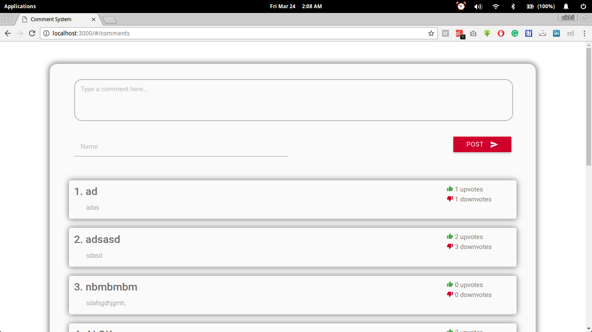

# Comment System(Rentomojo Assignment)

It is simple comment system application built using MEAN stack.




## Getting Started

These instructions will get you a copy of the project up and running on your local machine for development and testing purposes.

### Prerequisites

What things you need to install the software

```
node, express
```

### Installation

Install the dependencies of the app, Using :
```
npm install
```

## Running the app

Use below command, to start the server locally
```
npm start
```
After that, type 
```
http://localhost:3000/#/comments
```
in the browser.

### Functionalities

* User can post comment using comment box.
* User can upvote or downvote comment.

## Authors

* **Nikhil Mehandiratta** - *Initial work* - [someone12321](https://github.com/someone12321)
